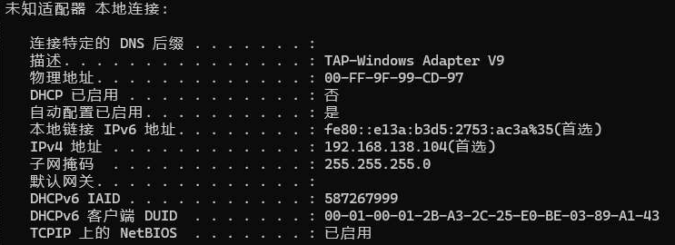
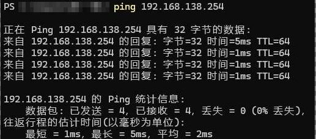

# virtuallan
## Description
virtuallan is a l2vpn. It can setup an virtual Ethernet LAN network in WAN.

## Features
* Basic auth for vpn endpoint
* AES encrypt for ethernet traffic
* Ethernet traffic in udp
* DHCP supported
* Pre-configured routes supported
* Monitor web supported

## How it work

* server create a linux bridge for each virtual ethernet network
* server create a tap interface for each authed endpoint
* client create a tap interface
* encrypt ethernet traffic that on tap interface and send to udp conn
* receive udp stream from conn and decrypt then send to tap interface
* maintain a ip pool, endpoint get or release ip from or to it
* pre-configure routes in config.yaml, and the server will multicast
  routes to each endpoint via 224.0.0.1:9999, when endpoint received
  it, sync local tap routes

An udp connection just like a cable connect dc and ep taps. And the taps became to a pair linux veth peer, connected to a linux bridge.

## Build

```
# Build a binary, run make it will generate a random aes key in confg.yaml
make

# Build a docker image
>IMG=\<your image name>:\<tag> make build-docker
```

**Windows support**

1. Before launch it, make sure [tap-windows](https://github.com/OpenVPN/tap-windows6) has been install.
2. Install a Tap-Windows Adapter
   ```
   .\devcon.exe OemVista.inf tap0901
   ```
3. Checkout to win branch
4. Build a windows exe
   ```
   GOOS=windows GOARCH=amd64 go build -o virtuallan.exe main.go
   ```
5. Launch virtuallan.exe
   
6. Enjoy it
   
   

go generate will generate an random aes key

## Ready to use

### Config.yaml

```
port: 6123                 # The udp port server listened, default 6123
ip: 192.168.123.254/24                         # The ip of server
dhcp-range: 192.168.123.100-192.168.123.200    # DHCP ip range
bridge: br0                                    # Bridge name of server
log-level: info                                # Log level, default info
key: B5FFCEE73EF298A4                          # The AES key, length 16Bytes
routes:                    # Routes, To cidr via nexthop, nexthop use endpoint username
  - cidr: 172.17.15.0/24
    nexthop: SERVER        # route nexthop via virtuallan server
  - cidr: 192.168.0.0/24
    nexthop: wj            # route nexthop username, will be parse to user ip
web:                       # Web config
  enable: true             # Set to true to enable web, default false
  port: 8000               # Web server listen port
```

**Server**
```
➜  ~ virtuallan server -h
NAME:
   virtuallan server - run virtuallan server

USAGE:
   virtuallan server [command options] [arguments...]

OPTIONS:
   --config-dir value, -d value  config directory to launch virtuallan server, conf.yaml as config file, users as user storage
   --help, -h                    show help
```

config dir files:
* config.yaml: server config file
* users: user database csv format \<username>,\<user passwd base64 encode>

**Endpoint**
```
➜  ~ virtuallan client -h
NAME:
   virtuallan client - connect to virtuallan server

USAGE:
   virtuallan client [command options] [arguments...]

OPTIONS:
   --target value, -t value     socket virtuallan server listened on
   --user value, -u value       username of virtuallan endpoint
   --passwd value, -p value     password of virtuallan endpoint user
   --key value, -k value        encryption key of virtuallan
   --log-level value, -l value  log level (default: info)
   --help, -h                   show help
```

If not set -u and -p flags, you need to input user name and passwd in console

**User manage**

```
➜  virtuallan git:(master) ✗ ./virtuallan user list  -d ./config/users
shawn,guest
➜  virtuallan git:(master) ✗ ./virtuallan user add -h
NAME:
   virtuallan user add - add user

USAGE:
   virtuallan user add [command options] [arguments...]

OPTIONS:
   --db value, -d value      user db file loaction
   --user value, -u value    username of user
   --passwd value, -p value  password of user
   --help, -h                show help
```

### Try it out

If enable web, it will start a http server on port 8000. Check the endpoints in index page.


Links of virtuallan server
```
Alpine-GW:~# ip a show br-vl
120: br-vl: <BROADCAST,MULTICAST,UP,LOWER_UP> mtu 1500 qdisc noqueue state UP group default qlen 1000
    link/ether 9a:6d:ae:1d:5b:47 brd ff:ff:ff:ff:ff:ff
    inet 192.168.138.254/24 brd 192.168.138.255 scope global br-vl
       valid_lft forever preferred_lft forever
    inet6 fe80::7c46:faff:feb5:e372/64 scope link 
       valid_lft forever preferred_lft forever
Alpine-GW:~# ip l show master br-vl
122: tap-XudE: <BROADCAST,MULTICAST,UP,LOWER_UP> mtu 1500 qdisc pfifo_fast master br-vl state UNKNOWN mode DEFAULT group default qlen 1000
    link/ether 9a:6d:ae:1d:5b:47 brd ff:ff:ff:ff:ff:ff
123: tap-mDuc: <BROADCAST,MULTICAST,UP,LOWER_UP> mtu 1500 qdisc pfifo_fast master br-vl state UNKNOWN mode DEFAULT group default qlen 1000
    link/ether 9e:76:5a:46:3e:37 brd ff:ff:ff:ff:ff:ff
124: tap-NFvv: <BROADCAST,MULTICAST,UP,LOWER_UP> mtu 1500 qdisc pfifo_fast master br-vl state UNKNOWN mode DEFAULT group default qlen 1000
    link/ether 5a:c1:3f:2c:2e:e8 brd ff:ff:ff:ff:ff:ff
```
