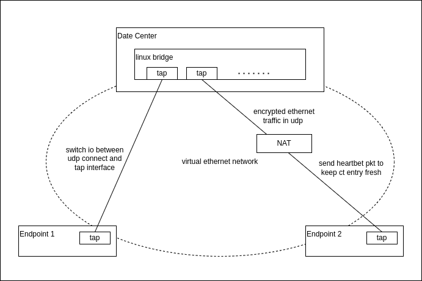

# virtuallan
## Description
virtuallan is a l2vpn. It can setup an virtual Ethernet LAN network in WAN.

## Features
* Basic auth for vpn endpoint
* AES encrypt for ethernet traffic
* Ethernet traffic in udp

## How it work

* server create a linux bridge for each virtual ethernet network
* server create a tap interface for each authed endpoint
* client create a tap interface
* encrypt ethernet traffic that on tap interface and send to udp conn
* receive udp stream from conn and decrypt then send to tap interface

An udp connection just like a cable connect dc and ep taps. And the taps became to a pair linux veth peer, connected to a linux bridge.

## Build

```
➜  virtuallan git:(master) ✗ make
go generate pkg/cipher/cipher.go
go build -o virtuallan main.go
```

go generate will generate an random aes key

## Use with docker

**Build**
>IMG=\<your image name>:\<tag> make build-docker

**Run docker image as server**
>docker run --privileged=true -d --restart always -p 6123:6123/udp -p 8000:8000 quay.io/shawnlu0127/virtuallan:20240507

## Getting started

**Server**
```
➜  ~ virtuallan server -h
NAME:
   virtuallan server - run virtuallan server

USAGE:
   virtuallan server [command options] [arguments...]

OPTIONS:
   --config-dir value, -d value  config directory to launch virtuallan server, conf.yaml as config file, users as user storage
   --help, -h                    show help
```

config dir files:
* config.yaml: server config file
* users: user database csv format \<username>,\<user passwd base64 encode>

config.yaml

```
port: 6123                                     # UDP server port
ip: 192.168.123.254/24                         # Server local ip address
dhcp-range: 192.168.123.100-192.168.123.200    # DHCP ip pool
bridge: br0                                    # Server local bridge name
log-level: info                                # Log level
web:
  enable: true                                 # Monitor server enable, default false
  port: 8000                                   # Web server port
```

**Endpoint**
```
➜  ~ virtuallan client -h
NAME:
   virtuallan client - connect to virtuallan server

USAGE:
   virtuallan client [command options] [arguments...]

OPTIONS:
   --target value, -t value  socket virtuallan server listened on
   --user value, -u value    username of virtuallan endpoint
   --passwd value, -p value  password of virtuallan endpoint user
   --help, -h                show help
```

If not set -u and -p flags, you need to input user name and passwd in console

**User manage**

```
➜  virtuallan git:(master) ✗ ./virtuallan user list  -d ./config/users
shawn,guest
➜  virtuallan git:(master) ✗ ./virtuallan user add -h
NAME:
   virtuallan user add - add user

USAGE:
   virtuallan user add [command options] [arguments...]

OPTIONS:
   --db value, -d value      user db file loaction
   --user value, -u value    username of user
   --passwd value, -p value  password of user
   --help, -h                show help
```

### Try it out

If enable web, it will start a http server on port 8000. Check the endpoints in index page.


Links of virtuallan server
```
Alpine-GW:~# ip a show br-vl
120: br-vl: <BROADCAST,MULTICAST,UP,LOWER_UP> mtu 1500 qdisc noqueue state UP group default qlen 1000
    link/ether 9a:6d:ae:1d:5b:47 brd ff:ff:ff:ff:ff:ff
    inet 192.168.138.254/24 brd 192.168.138.255 scope global br-vl
       valid_lft forever preferred_lft forever
    inet6 fe80::7c46:faff:feb5:e372/64 scope link 
       valid_lft forever preferred_lft forever
Alpine-GW:~# ip l show master br-vl
122: tap-XudE: <BROADCAST,MULTICAST,UP,LOWER_UP> mtu 1500 qdisc pfifo_fast master br-vl state UNKNOWN mode DEFAULT group default qlen 1000
    link/ether 9a:6d:ae:1d:5b:47 brd ff:ff:ff:ff:ff:ff
123: tap-mDuc: <BROADCAST,MULTICAST,UP,LOWER_UP> mtu 1500 qdisc pfifo_fast master br-vl state UNKNOWN mode DEFAULT group default qlen 1000
    link/ether 9e:76:5a:46:3e:37 brd ff:ff:ff:ff:ff:ff
124: tap-NFvv: <BROADCAST,MULTICAST,UP,LOWER_UP> mtu 1500 qdisc pfifo_fast master br-vl state UNKNOWN mode DEFAULT group default qlen 1000
    link/ether 5a:c1:3f:2c:2e:e8 brd ff:ff:ff:ff:ff:ff
```
